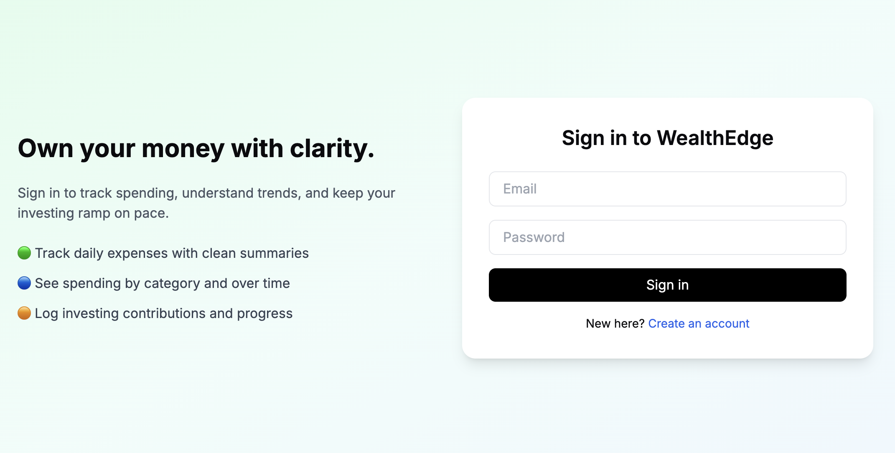
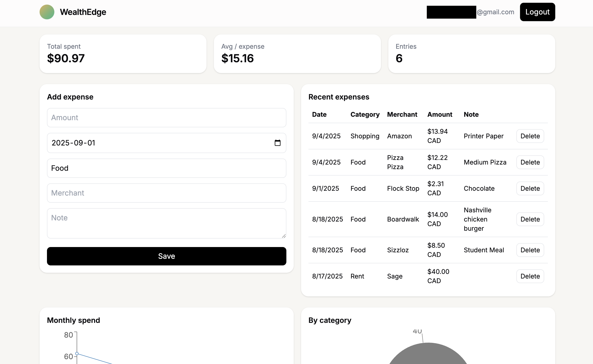

# WealthEdge 💰  
*A modern full-stack expense and investing tracker to help you own your money with clarity.*  
Inspired by Wealthsimple’s minimalist design, built with performance and security in mind.

---

## ✨ Features
- 🔐 **User Authentication** — secure login & signup with JWT tokens  
- 💸 **Expense Tracking** — log daily expenses with category, merchant, and notes  
- 📊 **Summaries & Charts** — view total spent, average per expense, and recent transactions with interactive graphs  
- 📈 **Investing Contributions** — track investing progress and total saved  
- 🛡 **Security** — JWT auth, bcrypt password hashing, rate limiting, CORS, Helmet  
- ⚡ **Performance** — optimized PostgreSQL queries and lightweight Node.js backend  

---

## 🛠 Tech Stack
- **Frontend**: React, Vite, TailwindCSS, Recharts  
- **Backend**: Node.js, Express, PostgreSQL  
- **Auth & Security**: JWT, bcrypt, Helmet, CORS, Rate Limiting, Morgan  
- **Dev Tools**: npm, Git, VS Code, REST APIs  
- **Workflow**: Agile/DevOps familiarity (local dev, GitHub version control, CI-ready structure)

---

## 📸 Screenshots

### Login / Signup


### Dashboard / Expenses


---

## ⚡ Getting Started

### Prerequisites
- Node.js (>= 18.x)  
- PostgreSQL  

### Setup
1. Clone this repository  
   ```bash
   git clone https://github.com/Hasnain-Azam/Wealthedge.git
   cd Wealthedge